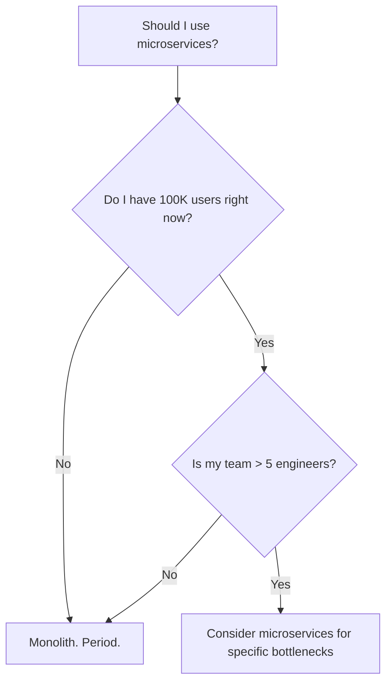
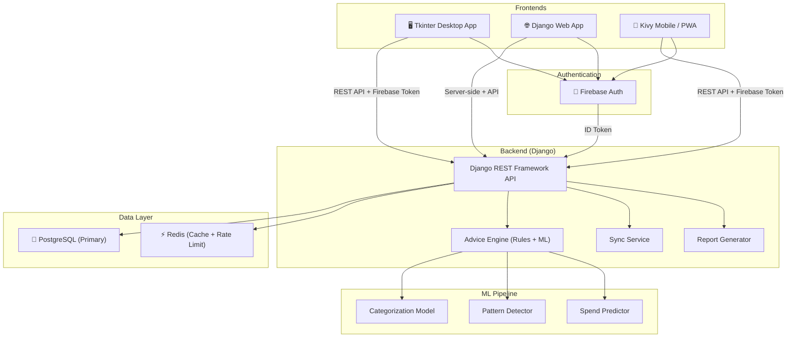
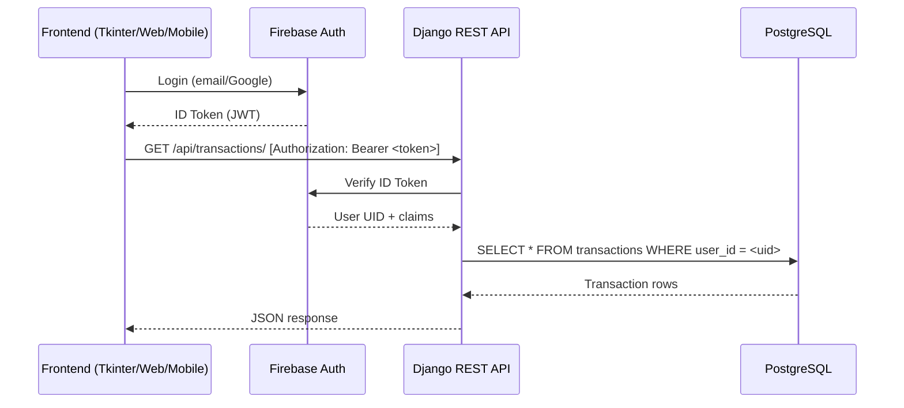
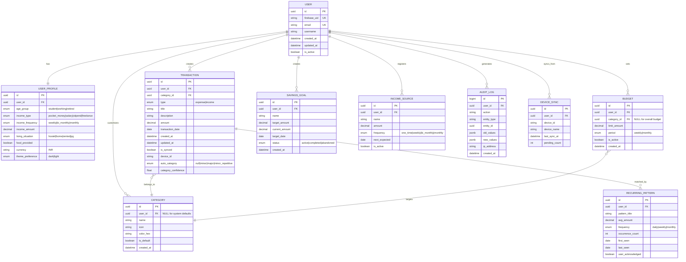
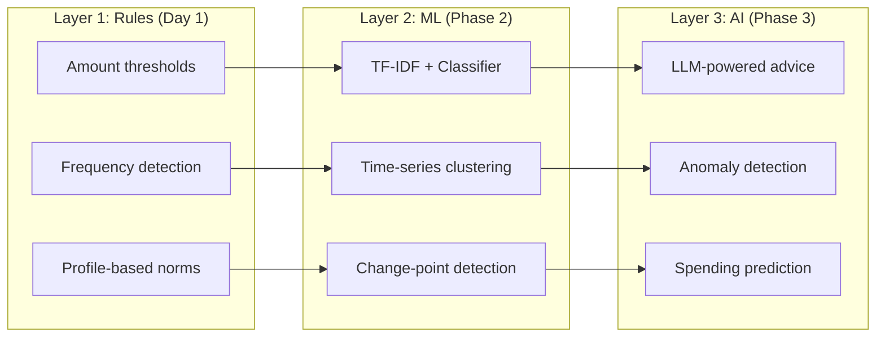
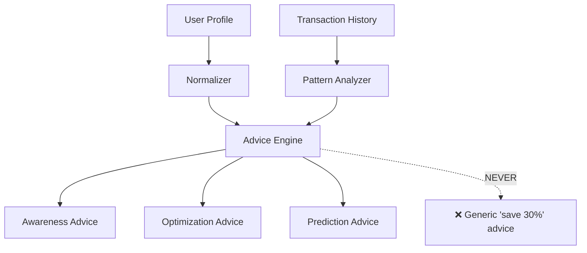
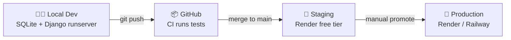
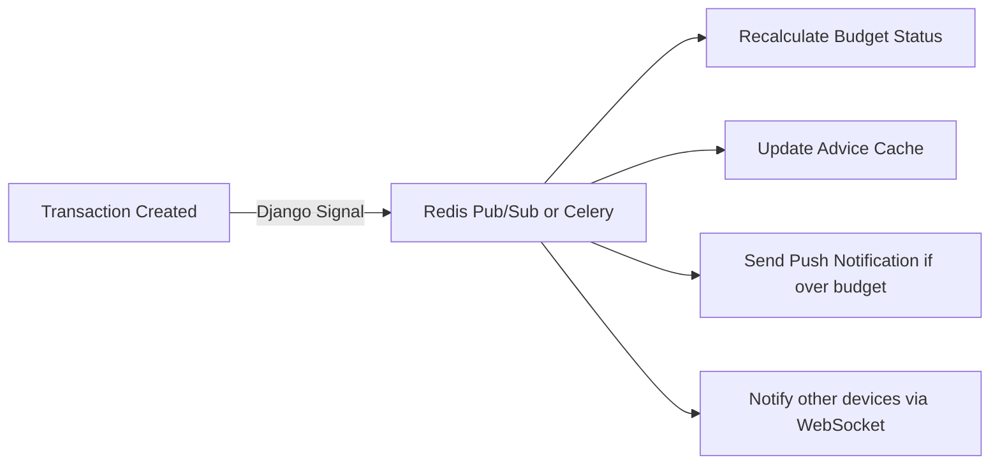

# PocketSense — Complete System Architecture

> A context-aware expense tracker for students who actually need to save money, not finance gurus who want dashboards.

---

## Table of Contents

1. [Brutally Honest Assessments First](#1-brutally-honest-assessments-first)
2. [Architecture Decision: Monolith vs Microservices](#2-architecture-decision-monolith-vs-microservices)
3. [Core Features — MVP (Phase 1)](#3-core-features--mvp-phase-1)
4. [Advanced Features (Phase 2 & 3)](#4-advanced-features-phase-2--3)
5. [System Architecture](#5-system-architecture)
6. [Database Schema](#6-database-schema)
7. [API Structure](#7-api-structure)
8. [ML Pipeline](#8-ml-pipeline)
9. [Folder Structure](#9-folder-structure)
10. [Security Best Practices](#10-security-best-practices)
11. [Deployment Strategy](#11-deployment-strategy)
12. [Future AI Integrations](#12-future-ai-integrations)
13. [Monetization Ideas](#13-monetization-ideas)
14. [Common Mistakes Beginners Make](#14-common-mistakes-beginners-make)
15. [Cost Optimization](#15-cost-optimization)
16. [Scaling to 100K+ Users](#16-scaling-to-100k-users)

---

## 1. Brutally Honest Assessments First

> [!CAUTION]
>
> ### Tkinter CANNOT run on Android / Google Play
>
> Tkinter is a desktop-only GUI framework. It uses Tcl/Tk which does not compile for Android or iOS. There is **no path** from Tkinter to Google Play — not with PyInstaller, not with Buildozer, not with any wrapper.
>
> **If you want Google Play, your options are:**
>
> | Option               | Pros                                                  | Cons                                                     |
> | -------------------- | ----------------------------------------------------- | -------------------------------------------------------- |
> | **Kivy + Buildozer** | Python, cross-platform, your existing mockups fit     | Ugly default widgets, limited Android APIs, APK is 30MB+ |
> | **Flutter**          | Beautiful, fast, Google-native for Play Store         | Dart language (new learning curve)                       |
> | **React Native**     | Large ecosystem, JS-based                             | Not Python                                               |
> | **Web App (PWA)**    | One Django frontend works everywhere including mobile | No Play Store listing (unless wrapped in TWA)            |
>
> **My honest recommendation for YOUR situation:**
>
> - **Desktop** → Tkinter (fine, it works here)
> - **Web** → Django templates (you already planned this)
> - **Mobile / Google Play** → Either Kivy (stays in Python) or build a **PWA** from your Django web frontend (cheaper, faster, works offline with service workers)
>
> You can also do Kivy for mobile + Tkinter for desktop. They share the same backend API, so no logic duplication.

> [!WARNING]
>
> ### Firebase Auth — Use It Smart, Not as a Crutch
>
> Firebase Auth is fine for authentication, but **do NOT let Firebase become your backend**. Common trap:
>
> - People start with Firebase Auth → then add Firestore → then add Cloud Functions → suddenly your "backend" is 100% Firebase and you've learned nothing about actual backend engineering.
>
> **Correct approach:**
>
> - Firebase Auth handles: login, signup, Google sign-in, token generation
> - Your Django backend handles: **everything else** — validating Firebase tokens, storing data, business logic, ML
> - Firebase is a **door**, not the house

> [!IMPORTANT]
>
> ### ChatGPT Said "Kivy App Packaged as EXE with PyInstaller"
>
> That works but is fragile. Kivy apps packaged with PyInstaller produce 100MB+ executables and break across Windows versions. If your desktop target is Windows:
>
> - **Tkinter + PyInstaller** → produces ~15-30MB EXE, much cleaner
> - **Kivy + PyInstaller** → produces ~80-150MB EXE, slower startup
>
> This is another reason to use Tkinter for desktop and Kivy only for mobile.

---

## 2. Architecture Decision: Monolith vs Microservices

**Verdict: Start with a Modular Monolith. Justify why.**



**Why monolith for PocketSense (even at 100K users):**

| Factor            | Monolith             | Microservices                     |
| ----------------- | -------------------- | --------------------------------- |
| Development speed | ✅ Fast              | ❌ Slow (infra overhead)          |
| Deployment        | ✅ One artifact      | ❌ 5-10 services to manage        |
| Debugging         | ✅ Stack traces work | ❌ Distributed tracing needed     |
| Cost              | ✅ One server        | ❌ Multiple servers, service mesh |
| Solo developer    | ✅ Manageable        | ❌ Insane overhead                |

**But make it modular internally:**

```
django_backend/
├── apps/
│   ├── auth/          # Firebase auth integration
│   ├── transactions/  # Core expense/income CRUD
│   ├── analytics/     # Reports, charts, trends
│   ├── advice/        # ML + rules-based advice engine
│   ├── sync/          # Offline sync resolution
│   └── profiles/      # User financial profiles
```

Each Django app is a **logical boundary**. If one day you NEED to extract `advice/` into its own microservice (because ML inference is slow), you can. But don't pre-optimize.

> [!TIP]
> **Interview answer:** "I chose a modular monolith because the team size and user base didn't justify the operational complexity of microservices. The codebase is structured so that any module can be extracted into a service if bottlenecks emerge. This is how Shopify and GitHub started."

---

## 3. Core Features — MVP (Phase 1)

> Target: **Working app in ~6-8 weeks** that solves the actual problem.

### Authentication

- [ ] Firebase Auth: Email/password + Google Sign-In
- [ ] Django validates Firebase ID tokens on every API request
- [ ] User profile setup (onboarding questionnaire)

### Transaction Management

- [ ] Add expense: title, description, amount, date, category
- [ ] Add income: source, amount, date, frequency
- [ ] Edit / delete transactions
- [ ] Categories: Food, Travel, Shopping, Subscriptions, Misc (user-customizable)

### Dashboard

- [ ] Today's total spent
- [ ] Month-to-date total
- [ ] Year-to-date total
- [ ] Quick-action buttons (matching your mockup: Analytics, Wallet, Expense, Income, Savings Jar)

### Budget System

- [ ] Set monthly spending limit (overall)
- [ ] Set per-category limits
- [ ] "Off Budget!" warning toast (you already designed this)
- [ ] Visual progress bars showing budget consumption

### Wallet View

- [ ] Current balance display (animated wallet sprite from your assets)
- [ ] Balance = sum(income) - sum(expenses)

### Savings Jar

- [ ] Set savings goal
- [ ] Visual jar filling up based on savings (your 4-state sprites: no-savings → less → more → full)
- [ ] Manual "add to savings" from wallet

### Basic Analytics

- [ ] Weekly/monthly spending charts per category (matching your mockup)
- [ ] Pie chart: category-wise breakdown
- [ ] Spending trend line

### Settings

- [ ] Profile management
- [ ] Delete account
- [ ] About / FAQ / Feedback (matches your settings mockup)
- [ ] Dark mode / Light mode toggle

---

## 4. Advanced Features (Phase 2 & 3)

### Phase 2 (~4-6 weeks after MVP)

- [ ] **AI Expense Categorization** — auto-classify transactions from title/description
- [ ] **Repetitive Expense Detection** — detect patterns like "₹50 metro daily"
- [ ] **Context-Aware Advice** — rules-based engine using financial profile
- [ ] **CSV Export** — download monthly/yearly transaction data
- [ ] **Monthly PDF Report** — auto-generated spending summary
- [ ] **Offline Mode** — local SQLite cache, sync when online
- [ ] **Recurring Expense Tracking** — subscriptions, daily fixed costs

### Phase 3 (~8-12 weeks after MVP)

- [ ] **ML Spending Prediction** — "At this rate, you'll run out by the 22nd"
- [ ] **Anomaly Detection** — flag unusual transactions
- [ ] **Peer Comparison** (anonymous) — "Students like you spend ₹X on food"
- [ ] **Smart Notifications** — "You've already spent 80% of your food budget"
- [ ] **Multi-device Sync** — real-time sync across Tkinter desktop + web + mobile
- [ ] **Receipt Scanning** (OCR) — snap a bill, auto-fill transaction details

---

## 5. System Architecture

### High-Level Diagram



### Request Flow (Every API Call)



### Database Choice: PostgreSQL

**Why PostgreSQL over the alternatives:**

| Feature            | PostgreSQL                  | MySQL          | SQLite                 | MongoDB                 |
| ------------------ | --------------------------- | -------------- | ---------------------- | ----------------------- |
| ACID compliance    | ✅ Full                     | ✅ Full        | ⚠️ Limited concurrency | ❌ Eventual consistency |
| JSON support       | ✅ JSONB (indexed)          | ⚠️ Basic       | ❌                     | ✅ Native               |
| Window functions   | ✅                          | ✅             | ⚠️ Limited             | ❌                      |
| Full-text search   | ✅ Built-in                 | ⚠️             | ❌                     | ✅                      |
| Free hosting       | ✅ Supabase / Neon / Render | ✅ PlanetScale | ✅ Local               | ✅ Atlas                |
| Django ORM support | ✅ First-class              | ✅ Good        | ✅ Good                | ⚠️ Needs Djongo         |

**For financial data, you want ACID transactions. Period.** MongoDB is popular but wrong for this. If money is involved, use a relational database.

> [!NOTE]
> For local development, SQLite is fine (Django defaults to it). Switch to PostgreSQL for staging/production. Django ORM makes this a one-line settings change.

---

## 6. Database Schema

### Entity-Relationship Diagram



### Indexing Strategy

```sql
-- High-frequency queries: "show me my expenses this month"
CREATE INDEX idx_txn_user_date ON transactions(user_id, transaction_date DESC);

-- Category filtering: "show food expenses"
CREATE INDEX idx_txn_user_category ON transactions(user_id, category_id);

-- Sync queries: "what hasn't been synced yet?"
CREATE INDEX idx_txn_unsynced ON transactions(user_id, is_synced) WHERE is_synced = false;

-- Budget checks: "am I over budget?"
CREATE INDEX idx_budget_active ON budgets(user_id, is_active) WHERE is_active = true;

-- Recurring pattern matching
CREATE INDEX idx_txn_title_amount ON transactions(user_id, title, amount);

-- Audit log (append-only, query by user + time)
CREATE INDEX idx_audit_user_time ON audit_logs(user_id, created_at DESC);
```

> [!TIP]
> **Don't create indexes upfront.** Ship MVP without custom indexes. Then use `EXPLAIN ANALYZE` on slow queries to add indexes where they actually help. Premature indexing wastes disk and slows writes.

---

## 7. API Structure

### Base URL: `https://api.pocketsense.app/api/v1/`

### Endpoints Overview

| Method           | Endpoint                     | Description                            | Auth |
| ---------------- | ---------------------------- | -------------------------------------- | ---- |
| `POST`           | `/auth/verify/`              | Verify Firebase token, create/get user | ✅   |
| `GET/PUT`        | `/profile/`                  | Get/update user financial profile      | ✅   |
| `GET/POST`       | `/transactions/`             | List/create transactions               | ✅   |
| `GET/PUT/DELETE` | `/transactions/{id}/`        | Read/update/delete a transaction       | ✅   |
| `GET`            | `/transactions/summary/`     | Dashboard summary (today/month/year)   | ✅   |
| `GET/POST`       | `/categories/`               | List/create custom categories          | ✅   |
| `GET/POST`       | `/budgets/`                  | List/create budgets                    | ✅   |
| `GET`            | `/budgets/status/`           | Current budget consumption             | ✅   |
| `GET/POST`       | `/savings/`                  | List/create savings goals              | ✅   |
| `PUT`            | `/savings/{id}/deposit/`     | Add money to jar                       | ✅   |
| `GET/POST`       | `/income-sources/`           | List/create income sources             | ✅   |
| `GET`            | `/analytics/weekly/`         | Weekly spending breakdown              | ✅   |
| `GET`            | `/analytics/monthly/`        | Monthly trend data                     | ✅   |
| `GET`            | `/analytics/category-split/` | Pie chart data                         | ✅   |
| `GET`            | `/advice/`                   | Get contextual advice                  | ✅   |
| `GET`            | `/patterns/`                 | Detected recurring patterns            | ✅   |
| `GET`            | `/export/csv/`               | Download CSV                           | ✅   |
| `GET`            | `/export/pdf/`               | Download monthly PDF report            | ✅   |
| `POST`           | `/sync/push/`                | Push offline transactions              | ✅   |
| `GET`            | `/sync/pull/`                | Pull latest from server                | ✅   |

### Request / Response Examples

#### `POST /auth/verify/` — First-time login / token verification

```json
// Request
{
  "firebase_token": "eyJhbGciOiJSUzI1NiIs..."
}

// Response (200 OK)
{
  "user_id": "a1b2c3d4-...",
  "email": "student@example.com",
  "is_new_user": true,
  "token": "django-session-or-jwt"
}
```

#### `POST /transactions/` — Add an expense

```json
// Request
{
  "type": "expense",
  "title": "Biryani from Meghana",
  "description": "Lunch with roommate",
  "amount": 320.00,
  "category_id": "food-uuid",
  "transaction_date": "2026-02-18"
}

// Response (201 Created)
{
  "id": "txn-uuid-...",
  "type": "expense",
  "title": "Biryani from Meghana",
  "description": "Lunch with roommate",
  "amount": 320.00,
  "category": {
    "id": "food-uuid",
    "name": "Food",
    "icon": "food.png"
  },
  "transaction_date": "2026-02-18",
  "auto_category": "minor",
  "category_confidence": 0.92,
  "budget_warning": {
    "triggered": true,
    "message": "You've used 85% of your Food budget this month",
    "budget_limit": 3000.00,
    "spent_so_far": 2550.00
  }
}
```

#### `GET /transactions/summary/` — Dashboard data

```json
// Response (200 OK)
{
  "today": {
    "total_spent": 470.0,
    "transaction_count": 3
  },
  "this_month": {
    "total_spent": 4200.0,
    "total_income": 5000.0,
    "net": 800.0
  },
  "this_year": {
    "total_spent": 12500.0,
    "total_income": 15000.0
  },
  "wallet_balance": 2500.0,
  "savings_jar": {
    "current": 1200.0,
    "target": 5000.0,
    "fill_state": "less" // maps to your sprite: no/less/more/full
  },
  "active_budgets": [
    {
      "category": "Food",
      "limit": 3000.0,
      "spent": 2550.0,
      "percentage": 85,
      "status": "warning"
    }
  ]
}
```

#### `GET /advice/` — Context-aware spending advice

```json
// Response (200 OK)
{
  "advice": [
    {
      "type": "awareness",
      "message": "92% of your spending is on food. Since your hostel provides meals, this might be compensatory spending.",
      "confidence": "high",
      "data_points": 45
    },
    {
      "type": "optimization",
      "message": "You buy snacks 5x/week averaging ₹80 each. Buying in bulk once a week could save ~₹100/month.",
      "confidence": "medium",
      "data_points": 20
    },
    {
      "type": "prediction",
      "message": "At current pace, you'll exhaust this month's pocket money by Feb 24th.",
      "confidence": "high",
      "data_points": 18
    }
  ],
  "profile_context": {
    "user_type": "student",
    "income_type": "pocket_money",
    "living_situation": "hostel",
    "food_provided": true
  }
}
```

#### `POST /sync/push/` — Upload offline transactions

```json
// Request
{
  "device_id": "desktop-win-abc123",
  "transactions": [
    {
      "local_id": "local-1",
      "type": "expense",
      "title": "Auto fare",
      "amount": 150.00,
      "transaction_date": "2026-02-17",
      "created_at": "2026-02-17T14:30:00Z"
    }
  ],
  "last_sync_at": "2026-02-16T10:00:00Z"
}

// Response (200 OK)
{
  "synced": 1,
  "conflicts": [],
  "server_id_map": {
    "local-1": "server-uuid-..."
  }
}
```

---

## 8. ML Pipeline

### Architecture: Rules First, ML Second



### Model 1: Expense Magnitude Classification

**Input:** title, description, amount, user's income_amount
**Output:** `minor` | `major` | `minor_repetitive`

**Phase 1 (Rules):**

```python
def classify_expense(amount, income, frequency_count):
    ratio = amount / income
    if frequency_count >= 3 and ratio < 0.05:
        return "minor_repetitive"  # ₹50 metro, 5x/week
    elif ratio < 0.10:
        return "minor"             # ₹200 lunch
    else:
        return "major"             # ₹2000 shopping
```

**Phase 2 (ML):**

- TF-IDF on title+description → feature vector
- Add numerical features: amount, time_of_day, day_of_week
- Logistic Regression or Random Forest classifier
- Train on user's own labeled data (they confirm/correct categories)

### Model 2: Recurring Pattern Detection

**Not ML initially. Pure frequency analysis.**

```python
# Group by (title_normalized, amount_range)
# Detect: same thing, similar amount, regular intervals
# Flag as recurring if: >= 3 occurrences, interval std_dev < 2 days
```

**Phase 3 upgrade:** DBSCAN clustering on transaction embeddings to find similar-but-not-identical recurring expenses.

### Model 3: Context-Aware Advice Engine

**This is the killer feature. Here's how it actually works:**



**Critical rule (your insight, and it's correct):**

The model MUST know:

- Is the user earning or dependent?
- Is food optional or compensatory?
- Is spending avoidable or structural?

**If `living_situation = hostel AND food_provided = true AND food_expense_ratio > 0.8`:**

- ✅ "Your food spending might be compensating for meal quality. Consider weekly snack bulk-buying."
- ❌ ~~"Reduce your food expenses"~~ (this is tone-deaf)

### Where Models Live

**Models are NOT in the Django process.** They're pre-trained and loaded at startup:

```
ml_models/
├── categorizer/
│   ├── model_v1.joblib        # scikit-learn model
│   ├── vectorizer_v1.joblib   # TF-IDF vectorizer
│   └── metadata.json          # version, accuracy, training date
├── patterns/
│   └── detector.py            # Rule-based, no model file
└── advice/
    └── rules_engine.py        # Rules first, ML hooks later
```

> [!WARNING]
> **Do NOT use a live API call to an LLM for every advice request.** That's expensive and slow. Pre-compute advice nightly or on transaction save. Cache it. Serve from cache.

---

## 9. Folder Structure

```
PocketSense/
│
├── assets/                        # ✅ Already exists
│   ├── icons/                     # 23 icons
│   └── sprites/                   # 5 animated sprites
│
├── backend/                       # Django backend (THE brain)
│   ├── manage.py
│   ├── requirements.txt
│   ├── pocketsense/               # Django project config
│   │   ├── settings/
│   │   │   ├── base.py            # Shared settings
│   │   │   ├── dev.py             # SQLite, DEBUG=True
│   │   │   └── prod.py            # PostgreSQL, DEBUG=False
│   │   ├── urls.py
│   │   ├── wsgi.py
│   │   └── asgi.py
│   │
│   ├── apps/
│   │   ├── accounts/              # Firebase auth integration
│   │   │   ├── models.py          # User, UserProfile
│   │   │   ├── serializers.py
│   │   │   ├── views.py
│   │   │   ├── firebase.py        # Token verification logic
│   │   │   └── tests/
│   │   │
│   │   ├── transactions/          # Core CRUD
│   │   │   ├── models.py          # Transaction, Category
│   │   │   ├── serializers.py
│   │   │   ├── views.py
│   │   │   ├── filters.py         # Date, category, amount filters
│   │   │   └── tests/
│   │   │
│   │   ├── budgets/               # Budget tracking
│   │   │   ├── models.py          # Budget, SavingsGoal
│   │   │   ├── signals.py         # Check budget on transaction save
│   │   │   └── tests/
│   │   │
│   │   ├── analytics/             # Reports & charts
│   │   │   ├── views.py           # Summary, trends, splits
│   │   │   ├── exporters.py       # CSV + PDF generation
│   │   │   └── tests/
│   │   │
│   │   ├── advice/                # ML + rules advice engine
│   │   │   ├── engine.py          # Core advice logic
│   │   │   ├── rules.py           # Rule-based advice
│   │   │   ├── ml_hooks.py        # ML model integration
│   │   │   └── tests/
│   │   │
│   │   └── sync/                  # Offline sync
│   │       ├── views.py           # Push/pull endpoints
│   │       ├── resolver.py        # Conflict resolution
│   │       └── tests/
│   │
│   └── ml_models/                 # Trained model artifacts
│       ├── categorizer/
│       └── patterns/
│
├── frontend_web/                  # Django templates (web frontend)
│   ├── templates/
│   │   ├── base.html
│   │   ├── dashboard.html
│   │   ├── transactions.html
│   │   ├── analytics.html
│   │   └── auth/
│   ├── static/
│   │   ├── css/
│   │   ├── js/
│   │   └── images/               # Symlink or copy from assets/
│   └── templatetags/
│
├── frontend_desktop/              # Tkinter app
│   ├── main.py                    # App entry point
│   ├── config.py                  # API base URL, settings
│   ├── api_client.py              # HTTP client for backend API
│   ├── local_db.py                # SQLite for offline cache
│   ├── screens/
│   │   ├── login.py
│   │   ├── dashboard.py
│   │   ├── transactions.py
│   │   ├── analytics.py
│   │   ├── wallet.py
│   │   ├── savings_jar.py
│   │   └── settings.py
│   ├── widgets/                   # Reusable Tkinter components
│   │   ├── toast.py               # "Off Budget!" warning
│   │   ├── animated_jar.py        # Savings jar with sprites
│   │   └── chart.py               # matplotlib embedded charts
│   └── utils/
│       ├── theme.py               # Dark/light mode colors
│       └── firebase_auth.py       # Firebase auth for desktop
│
├── frontend_mobile/               # Kivy app (if you go this route)
│   ├── main.py
│   ├── buildozer.spec
│   ├── screens/
│   └── api_client.py              # Same API, different UI
│
├── ml_training/                   # Model training scripts (NOT in production)
│   ├── notebooks/
│   │   ├── explore_categories.ipynb
│   │   └── pattern_analysis.ipynb
│   ├── train_categorizer.py
│   ├── evaluate.py
│   └── data/                      # Training data (gitignored)
│
├── docker/
│   ├── Dockerfile.backend
│   ├── Dockerfile.web
│   └── docker-compose.yml
│
├── .github/
│   └── workflows/
│       ├── test.yml               # Run tests on PR
│       └── deploy.yml             # Deploy on merge to main
│
├── docs/
│   ├── API.md
│   ├── SETUP.md
│   └── ARCHITECTURE.md
│
├── ideas-design/                  # ✅ Already exists (your mockups)
├── .env.example
├── .gitignore
└── README.md
```

---

## 10. Security Best Practices

### Authentication & Authorization

| Practice                    | Implementation                                                   |
| --------------------------- | ---------------------------------------------------------------- |
| Never store passwords       | Firebase handles password hashing                                |
| Validate tokens server-side | Every API request → `firebase_admin.auth.verify_id_token()`      |
| Token expiry                | Firebase tokens expire in 1 hour; client refreshes automatically |
| Row-level security          | Every query filters by `user_id` — users ONLY see their own data |

### Data Protection

| Practice                 | Implementation                                            |
| ------------------------ | --------------------------------------------------------- |
| HTTPS everywhere         | SSL cert via Let's Encrypt or Cloudflare                  |
| SQL injection prevention | Django ORM parameterizes all queries by default           |
| XSS prevention           | Django templates auto-escape by default                   |
| CSRF protection          | Django middleware enabled for web frontend                |
| Rate limiting            | `django-ratelimit`: 100 requests/minute per user          |
| Input validation         | DRF serializers validate all input types, ranges, lengths |

### Environment & Secrets

```python
# NEVER do this:
SECRET_KEY = "hardcoded-secret"    # ❌

# ALWAYS do this:
SECRET_KEY = os.environ["SECRET_KEY"]  # ✅
# Store in .env file, load with python-decouple or django-environ
```

### Audit Logging

```python
# Every create/update/delete writes to audit_log
# This is non-negotiable for financial data
@receiver(post_save, sender=Transaction)
def log_transaction_change(sender, instance, created, **kwargs):
    AuditLog.objects.create(
        user=instance.user,
        action="created" if created else "updated",
        entity_type="transaction",
        entity_id=instance.id,
        new_values=serializer.data,
    )
```

### Data Encryption

| Layer            | What                                | How                                                             |
| ---------------- | ----------------------------------- | --------------------------------------------------------------- |
| In transit       | All API traffic                     | TLS 1.3 (HTTPS)                                                 |
| At rest          | PostgreSQL data                     | Cloud provider disk encryption (free on most)                   |
| Sensitive fields | Optional: encrypt description field | `django-fernet-fields` (only if you store truly sensitive data) |

> [!NOTE]
> For a student expense tracker, **TLS + Firebase Auth + row-level filtering is sufficient**. Don't over-engineer encryption unless you're storing bank account numbers or credit card data (you're not).

---

## 11. Deployment Strategy

### Development → Staging → Production Pipeline



### Recommended Free/Cheap Stack

| Component       | Service                                                        | Cost                         |
| --------------- | -------------------------------------------------------------- | ---------------------------- |
| Backend hosting | [Render](https://render.com) or [Railway](https://railway.app) | Free tier available          |
| PostgreSQL      | [Neon](https://neon.tech) or [Supabase](https://supabase.com)  | Free tier (500MB-1GB)        |
| Redis (cache)   | [Upstash](https://upstash.com)                                 | Free tier (10K requests/day) |
| Firebase Auth   | Google Firebase                                                | Free (up to 50K MAU)         |
| Static files    | Cloudflare R2 or Django Whitenoise                             | Free                         |
| Domain          | `.tech` or `.app` domain                                       | ~$3-10/year                  |
| CI/CD           | GitHub Actions                                                 | Free for public repos        |

### Docker Deployment

```yaml
# docker-compose.yml (production-like local setup)
services:
  backend:
    build:
      context: ./backend
      dockerfile: ../docker/Dockerfile.backend
    ports:
      - "8000:8000"
    env_file: .env
    depends_on:
      - db
      - redis

  db:
    image: postgres:16-alpine
    environment:
      POSTGRES_DB: pocketsense
      POSTGRES_USER: ps_user
      POSTGRES_PASSWORD: ${DB_PASSWORD}
    volumes:
      - pgdata:/var/lib/postgresql/data

  redis:
    image: redis:7-alpine
    ports:
      - "6379:6379"

volumes:
  pgdata:
```

### Kubernetes (Resume Purposes Only)

As ChatGPT correctly said: you don't need Kubernetes for this app. But for resume credibility:

```yaml
# k8s/deployment.yaml (run with Minikube locally)
apiVersion: apps/v1
kind: Deployment
metadata:
  name: pocketsense-api
spec:
  replicas: 2
  selector:
    matchLabels:
      app: pocketsense
  template:
    spec:
      containers:
        - name: api
          image: pocketsense-backend:latest
          ports:
            - containerPort: 8000
```

**You deploy this once locally, screenshot it working, mention it in resume. Done.**

---

## 12. Future AI Integrations

### Roadmap

| Phase    | Feature                      | Tech                                 | Complexity |
| -------- | ---------------------------- | ------------------------------------ | ---------- |
| Phase 2  | Auto-categorization          | scikit-learn (TF-IDF + LogReg)       | Low        |
| Phase 2  | Repetitive expense detection | Frequency analysis + DBSCAN          | Low-Med    |
| Phase 2  | Context-aware rules          | Python rules engine                  | Low        |
| Phase 3  | Spend prediction             | Prophet / ARIMA time-series          | Medium     |
| Phase 3  | Anomaly detection            | Isolation Forest                     | Medium     |
| Phase 3  | Natural language advice      | Fine-tuned small LLM or Gemini API   | High       |
| Phase 3  | Receipt OCR                  | Tesseract or Google Vision API       | Medium     |
| Phase 3+ | Peer benchmarking            | Federated aggregation (privacy-safe) | High       |

### Key Principle

> ML models should **explain**, not just **predict**. A student needs to understand WHY the app says something, not just WHAT it says.

---

## 13. Monetization Ideas

> [!IMPORTANT]
> Your target audience is **broke college students**. Any monetization must respect that.

| Strategy                    | When            | How                                                                         |
| --------------------------- | --------------- | --------------------------------------------------------------------------- |
| **Freemium**                | Launch          | Core tracking free. AI advice, PDF reports, analytics → premium (₹49/month) |
| **Ads (non-intrusive)**     | After 10K users | Banner in analytics page. NEVER on transaction entry.                       |
| **Student discounts**       | Always          | Free premium for `.edu` email users for 6 months                            |
| **Institutional licensing** | Phase 3         | Sell to hostels/colleges as "student financial wellness tool"               |
| **API access**              | Phase 3+        | Let fintech apps integrate PocketSense data (with user consent)             |
| **Affiliate**               | Phase 2         | Recommend savings accounts, UPI cashback offers (transparent, not spammy)   |

**What NOT to do:**

- ❌ Don't sell user financial data. Ever.
- ❌ Don't put ads on the "add expense" screen — that's where trust is.
- ❌ Don't gate basic features behind paywall — students will uninstall.

---

## 14. Common Mistakes Beginners Make

### Architecture Mistakes

| Mistake                                | Why It's Bad                                        | What To Do Instead                                              |
| -------------------------------------- | --------------------------------------------------- | --------------------------------------------------------------- |
| Writing business logic in the frontend | Every frontend duplicates logic; bugs multiply      | All logic in Django backend. Frontends are dumb display layers. |
| Using Firebase as the entire backend   | You learn nothing about backend engineering         | Firebase = auth only. Django = everything else.                 |
| Starting with microservices            | Solo dev managing 5 services = burnout              | Modular monolith. Extract later if needed.                      |
| No API versioning                      | Breaking changes break all frontends simultaneously | URL versioning: `/api/v1/` from day one                         |

### Database Mistakes

| Mistake                       | Why It's Bad                                              | What To Do Instead                                  |
| ----------------------------- | --------------------------------------------------------- | --------------------------------------------------- |
| Storing amounts as floats     | `0.1 + 0.2 = 0.30000000000000004`                         | Use `DecimalField(max_digits=12, decimal_places=2)` |
| No soft deletes               | Users accidentally delete transactions, you can't recover | Add `is_deleted` flag, filter it out in queries     |
| Storing categories as strings | "Food" vs "food" vs "FOOD" = 3 categories                 | Foreign key to `Category` table                     |
| No created_at/updated_at      | Can't debug, can't sync, can't audit                      | Add to EVERY model. Use `auto_now_add` / `auto_now` |

### Frontend Mistakes

| Mistake                         | Why It's Bad                                               | What To Do Instead                     |
| ------------------------------- | ---------------------------------------------------------- | -------------------------------------- |
| Hardcoding API URLs             | Can't switch between dev/staging/prod                      | Config file or environment variable    |
| No loading states               | Users click buttons multiple times, duplicate transactions | Disable button on click, show spinner  |
| No offline handling             | App crashes if no internet                                 | Queue transactions locally, sync later |
| No input validation client-side | Bad UX — user submits, gets error, loses input             | Validate before sending to API         |

### ML Mistakes

| Mistake                              | Why It's Bad                            | What To Do Instead                                              |
| ------------------------------------ | --------------------------------------- | --------------------------------------------------------------- |
| Training on insufficient data        | Model is garbage with <100 transactions | Start with rules, switch to ML after user has 200+ transactions |
| Using deep learning for tabular data | Overkill, slow, uninterpretable         | Logistic Regression, Random Forest, XGBoost                     |
| Not handling new users (cold start)  | ML model has nothing to work with       | Fallback to rules engine for new users                          |
| Making advice non-dismissible        | Users feel judged, uninstall the app    | Every advice card has "dismiss" and "not helpful" buttons       |

---

## 15. Cost Optimization

### At 0-1K Users (Student Budget)

| Resource  | Solution                      | Monthly Cost     |
| --------- | ----------------------------- | ---------------- |
| Backend   | Render free tier              | ₹0               |
| Database  | Neon free tier (3GB)          | ₹0               |
| Auth      | Firebase (free up to 50K MAU) | ₹0               |
| Domain    | `.tech` domain                | ~₹250/year       |
| **Total** |                               | **~₹0-20/month** |

### At 10K-100K Users

| Resource   | Solution                          | Monthly Cost            |
| ---------- | --------------------------------- | ----------------------- |
| Backend    | Render Starter ($7/mo) or Railway | ~₹600                   |
| Database   | Neon Pro or Supabase Pro          | ~₹2,000                 |
| Cache      | Upstash Pro                       | ~₹500                   |
| CDN        | Cloudflare (free tier)            | ₹0                      |
| Monitoring | Sentry free tier                  | ₹0                      |
| **Total**  |                                   | **~₹3,000-5,000/month** |

### Cost Killers to AVOID

- ❌ Don't use AWS/GCP until you have revenue — they're expensive at small scale
- ❌ Don't call OpenAI/Gemini API per transaction — batch process nightly
- ❌ Don't store images/receipts in PostgreSQL — use object storage (Cloudflare R2, free)

---

## 16. Scaling to 100K+ Users

### Caching Strategy

```
User requests dashboard → Check Redis cache (TTL: 5 min)
  → Cache HIT  → Return cached JSON instantly
  → Cache MISS → Query PostgreSQL → Store in Redis → Return
```

**What to cache:**

- Dashboard summary (5 min TTL)
- Category list (1 hour TTL)
- Advice (1 hour TTL or on transaction save)

**What NOT to cache:**

- Transaction list (always fresh)
- Balance/wallet (always fresh)

### Rate Limiting

```python
# Per-user rate limits
RATE_LIMITS = {
    "transactions_create": "60/hour",    # Normal usage
    "export_csv": "5/hour",              # Prevent abuse
    "export_pdf": "3/hour",              # Expensive to generate
    "sync_push": "30/hour",              # Offline sync bursts
    "auth_verify": "10/minute",          # Prevent brute force
}
```

### Event-Driven Architecture (Phase 3)

For real-time sync across devices:



**Don't implement this now.** This is for when you have real users on multiple devices simultaneously.

---

## Verification Plan

Since this is a design document with no code changes, verification is:

### User Review

- Review this architecture document for alignment with your vision
- Confirm or reject the frontend technology recommendation (Tkinter desktop + Kivy/PWA mobile)
- Confirm database choice (PostgreSQL)
- Confirm phased feature approach

### When Implementation Starts

- Each phase will have its own implementation plan with specific test commands
- Unit tests via `pytest` / `django test`
- API tests via Postman or `httpx`
- Browser tests for web frontend
- Manual testing for Tkinter/Kivy apps
